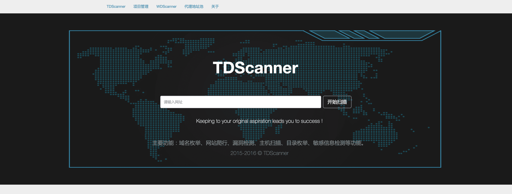
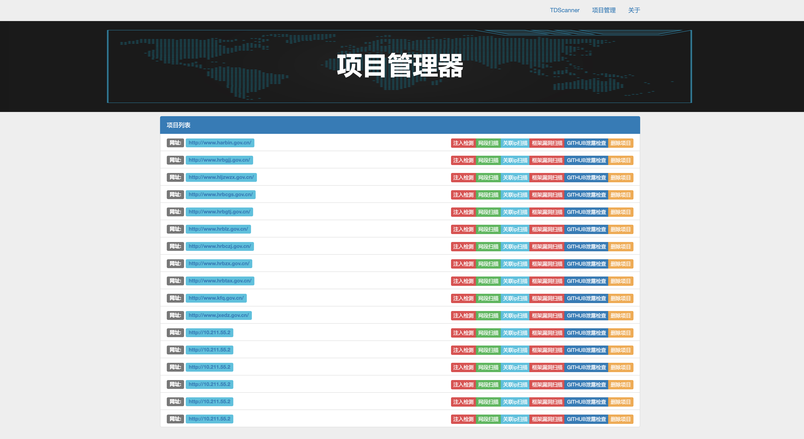
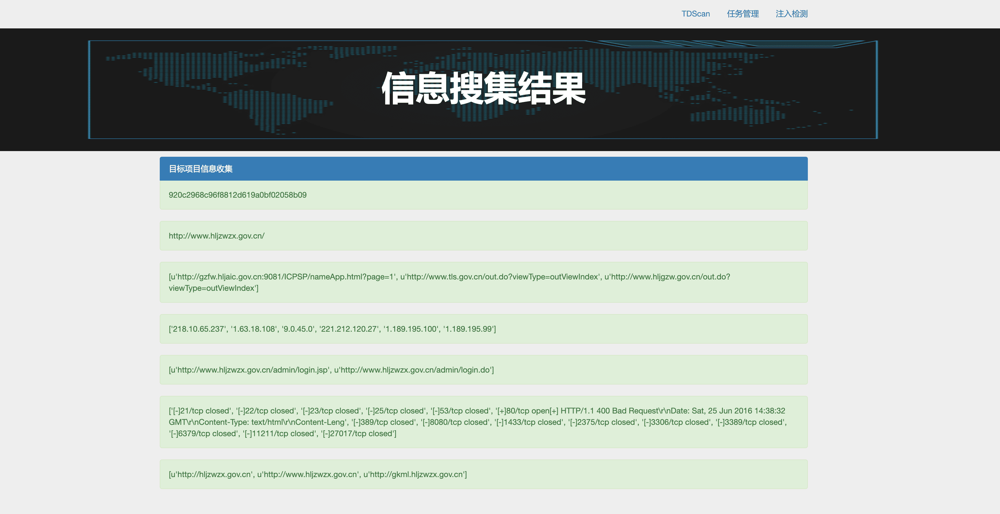
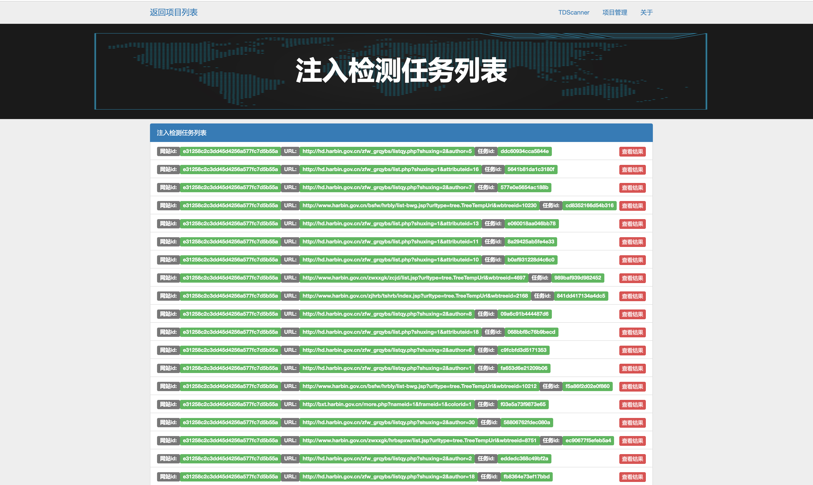
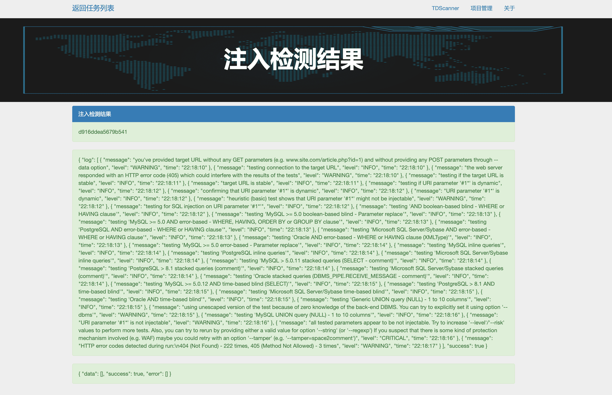

# TDScanner
自动化检测小工具，主要实现了子域名枚举、链接爬取、注入检测、主机扫描、目录枚举、敏感信息检测等功能~

```
tips:本系统不是自己原始开发的，忘了是从哪拖来的，然后自己修改添加了一些功能。有兴趣的小伙伴可以继续完善。
```

****

# 目录
* [Change_Log](#Change_Log)
* [Usage](#Usage)
* [Function](#Function)
    * 主入口界面
    * 项目管理
    * 信息搜集
    * 注入检测任务
    * 注入任务
* [ToDo](#ToDo)
    
    
# Change_Log

- [2017-04-02] 尝试重写，flask不是很顺手，感觉不如php方便，最终放弃
- [2017-03-18] 对信息探测进行了功能完善，发现框架存在问题
- [2017-03-13] 对SQL注入和网段扫描进行了完善
  
# Usage

使用比较简单：

1、安装flask和其他依赖

```
pip install flask

```

2、导入数据库文件TDScann.sql文件

```
mysql -u root -p

use TDScan

source TDScan.sql

```

3、运行脚本

```
python2 main.py
```

会提示http://0.0.0.0:5000，打开即可使用。

# Function

本来是想做个综合一体化的扫描平台，后来种种原因放弃。只是实现了子域名枚举、链接爬取、注入检测、主机扫描、目录枚举、敏感信息检测等。

- 主入口界面



- 项目管理


- 信息搜集



- 注入检测任务



- 注入任务




# ToDo

- 用php+python重新打造一个新的平台


# 和我联系


<div align=center></div>